

<h1>Forecasto</h1>

Lo strumento quotidiano di supervisione delle operazioni e previsioni del business, per aziende ad alta intensità operativa.

## Cashflow, Bilancio, CRM, Operations

Forecasto mira ad essere lo strumento di utilizzo quotidiano che ti supporta nelle decisioni più importanti. Ecco alcuni dei casi d'uso in cui Forecasto da il meglio di se, e di te.

- Cashflow previsionale
- Controllo dei costi
- Controllo delle scadenze di pagamento
- Simulazione di bilancio con budget
- Gestione delle trattative "calde" 

Il tutto con un insieme di relazioni tra operazioni e attività da svolgere suddivise per responsabile o reparto.

Oltre a questo permette di verificare velocemente alcune cose come:

- Fatturato per cliente/mese
- Costi mensili totali, fissi e variabili
- Operatività quotidiana dei responsabili o reparti

## Basic concepts
***Forecasto*** si sviluppa sui quattro concetti portanti del business con un differente orizzonte temporale e livello di certezza:

- **Budget**: operazioni che si prevede di svolgere
- **Prospect**: operazioni che verranno probabilmente svolte entro un certo periodo
- **Order**: operazioni che dovranno essere svolte entro un certo periodo, salvo contrattempi operativi
- **Actual**: operazioni immancabilmente svolte o comunque da svolgere indipendentemente da tutto

Ogni operazione è contraddistinta da una data di ingresso nel cashflow (presunta o effettiva), un conto (costo, ricavo, affitto, stipendi, etc) una referenza (un cliente, un collaboratore, un asset), una data di scadenza, un ammontare imponibile e l'eventuale aliquota iva.

Ad ogni operazione possono essere associate una o più **azioni**, con una **data** di scadenza, un **responsabile** e una **descrizione**.

Tutte le operazioni inserite vengono considerate in tre differenti viste:

- **Operazioni**: azioni da intraprendere per portare a compimento gli obiettivi rappresentati dalle operazioni
- **Flusso di cassa**: andamento effettivo e previsionale del flusso di cassa secondo le operazioni inserite e selezionate
- **Bilancio**: raggruppamento delle operazioni in costi e ricavi, fissi e variabili, con un bilancio effettivo o previsionale

Monitorando costantemente questi tre aspetti avremo modo di pilotare la nostra azienda verso gli obiettivi prefissati di vendita, margine e sostenibilità del business.

***Forecasto*** permette di analizzare gli aspetti **Operazioni**, **Flusso di cassa** e **Bilancio** in funzione dell'orizzonte temporale che si vuole considerare: se vogliamo concentrarci sui debiti e crediti certi piuttosto che su quello che prevediamo di vendere o comprare, basterà selezionare la vista **Attuale**, mentre se vogliamo intervenire sugli ordini da emettere o da evadere selezioneremo **Ordini**. La vista **Prospect** ci permetterà di concentrarci sulle trattative in corso e fare si che si concludano nei tempi prefissati. La vista **Budget** invece servirà a non perdere di vista gli obiettivi dell'anno o del periodo selezionato, mettendo in pratica le azioni e le tattiche necessarie. 

### Esempi per le voci Attuali

Tutte le cose certe, ormai definite e fissate nel tempo come costi, affitti, premi di assicurazione, abbonamente, buste paga collaboratori, fatture attive e passive vengono inserite nella sezione "Attuali".

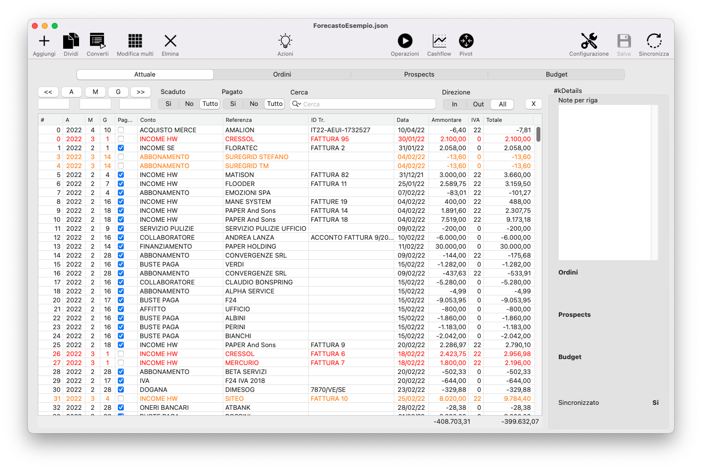

### Esempi per le voci Ordini

Gli ordini attivi e passivi vengono inseriti in questa sezione.

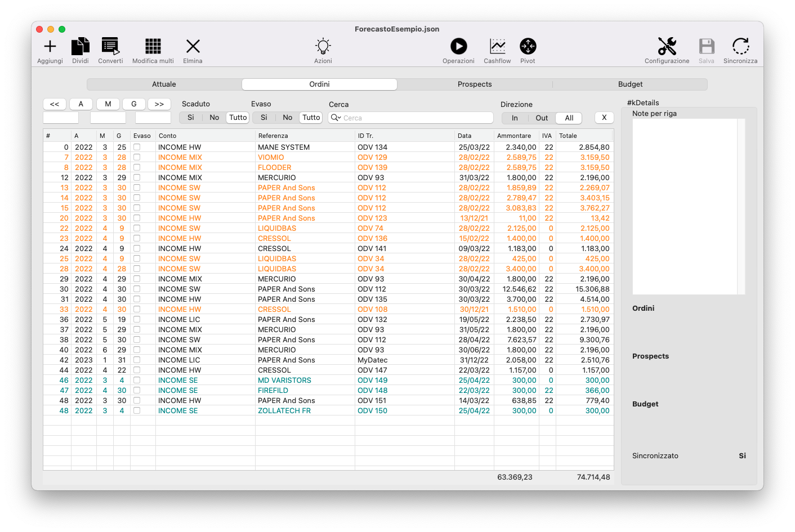

### Esempi per le voci Prospect

Tutte le trattative in corso possono essere inserite nella sezione Prospect. Tipicamente si inseriscono i clienti tali o potenziali a cui sono state inviate offerte.

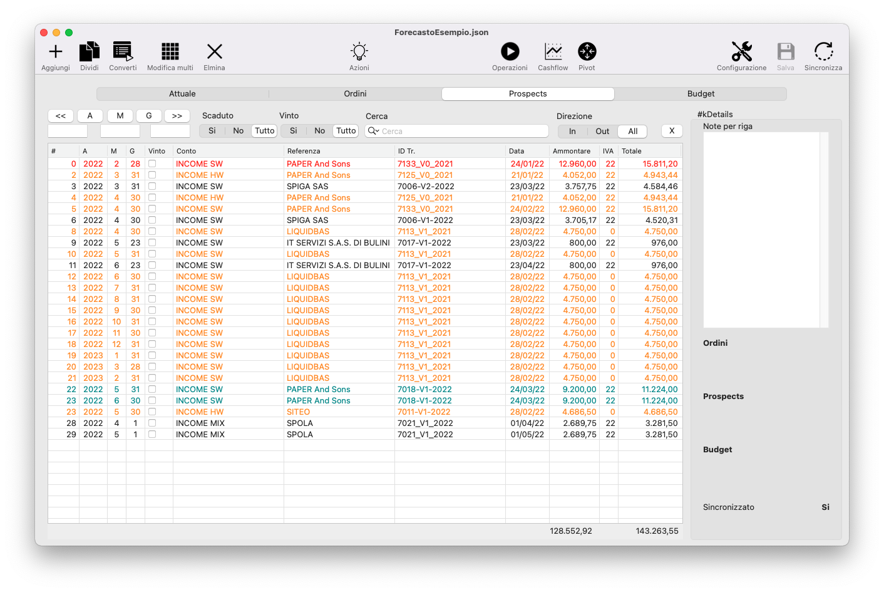

### Esempi per le voci Budget

In questa sezione possono trovare posto tutte le voci sia di costo che di ricavo previste nel tempo, ma non certe. Solitamente si inseriscono i costi e i ricavi derivanti dalle vendite mensili di prodotti e servizi commercializzati dall'azienda.

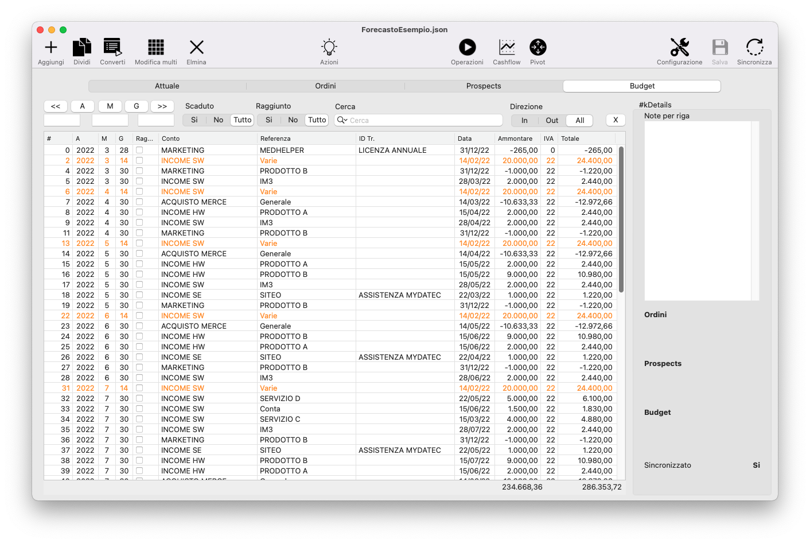

## Il ciclo di vita di un operazione

Dal **Budget** agli **Attuali**, attraverso **Prospect** e **Ordini**, questo è il percorso completo che un operazione compie.

Le operazioni però possono entrare anche direttamente in una sezione, ad esempio: la voce AFFITTO può entrare subito nell'Attuale se il contratto già esiste e si impostano le scadenze di pagamento mese per mese.

Al contrario, un operazione che entra nel Prospect come offerta inviata a cliente, quando si riceverà l'ordine verrà convertita e spostata nella sezione Ordini. 

Quando l'ordine verrà evaso, la riga potrà essere ulteriormente convertita in Attuale. La data della sezione A-M-G dovrà corrispondere in questo caso alla data di scadenza del pagamento.

Quando una riga viene convertita le azioni ad essa associate vengono ereditate dalla riga figlio. Viene anche aggiunta una azione con owner Sistema, data della conversione e descrizione: Convertito da....

In questo modo si potrà analizzare tutta la storia delle attività svolte per quell'operazione dalla sua nascita in Prospect fino alla sua conclusione in Attuali.

## Le colonne delle righe operazioni

Tutte le colonne delle righe operazioni sono funzionali alle analisi che vengono effettuate nelle viste del programma.

Partendo da sinistra:

- **Numero (#)**: E' un numero di riga, può essere utile per identificare la riga in modo univoco in fase di esportazione CSV
- **A**: Anno in cui la riga entra effettivamente nel cashflow
- **M**: Mese in cui la riga entra effettivamente  nel cashflow
- **G**: Giorno in cui la riga entra effettivamente  nel cashflow
- **Checkbox**: può assumere significati differenti in base alla sezione:
	- Attuale: pagata si/no
	- Ordini: evaso si/no
	- Prospect: vinto si/no
	- Budget: raggiunto si/no
- **Conto**: è il conto in cui verranno raggruppate le voci a livello di Bilancio
- **Referenza**: è il dettaglio del conto, un cliente, un fornitore, un asset
- **ID Tr.**: può assumere significati differenti in base alla sezione:
	- Attuale: numero del documento associato (fattura, ricevuta, contratto, etc)
	- Ordini: numero dell'ordine di acquisto o vendita
	- Prospect: numero dell'offerta di acquisto o vendita
	- Budget: può identificare un ulteriore livello di dettaglio, non sempre viene usato
- **Data**: può assumere un significato differente in base alla sezione:
	- Attuale: data di scadenza del pagamento (può essere differente da A-M-G)
	- Ordini: data di evasione dell'ordine
	- Prospect: data di scadenza dell'offerta
	- Budget: data in cui si prevede di vendere o acquistare un bene o servizio
- **Ammontare**: importo imponibile della riga
- **IVA**: Aliquota IVA in percentuale
- **Totale**: imponibile + IVA

## Regole dei colori

Le righe delle operazioni possono assumere differenti colorazioni a seconda dello stato in cui si trovano:

- **Nero**: nulla da segnalare
- **Azzurrino**: la riga è stata convertita da una sezione precedente, ad esempio: se vedo una riga azzurrina negli Ordini significa che è stata convertita da Prospect
- **Arancione**: la data di scadenza della riga è passata e la check-box della riga non è selezionata
- **Rosso**: la data di ingresso nel cashflow della riga è passata e la check-box della riga non è selezionata

I colori sopra elencati vengono sovrascritti dal successivo, es: se una riga è convertita, quindi azzurrina, in caso di scadenza passata sarà comunque arancione o rossa.

## Come inserire le operazioni

### Operazioni che si ripetono nel tempo

Selezionata la sezione interessata tra Attuale, Ordini, Prospect e Budget cliccheremo sul pulsante `Aggiungi`. Una nuova riga viene inserita in fondo alla tabella.
Immaginiamo di voler inserire le righe inerenti i costi dell'affitto mensile.
Sappiamo che l'importo annuale è di € 9.600,00.
Andremo ad inserire quindi la riga compilando tutti i campi.
A: 2022
M: 1
G: 6
Conto: Affitto
Referenza: Ufficio
ID Tr: <numero del contratto>
Data: 06/01/2022
Ammontare: 9600
Iva: 0

Adesso possiamo "splittare" la riga appena inserita cliccando sul campo "numero" per selezionarla, poi cliccando su `Dividi` apparirà una finestra di dialogo come segue:

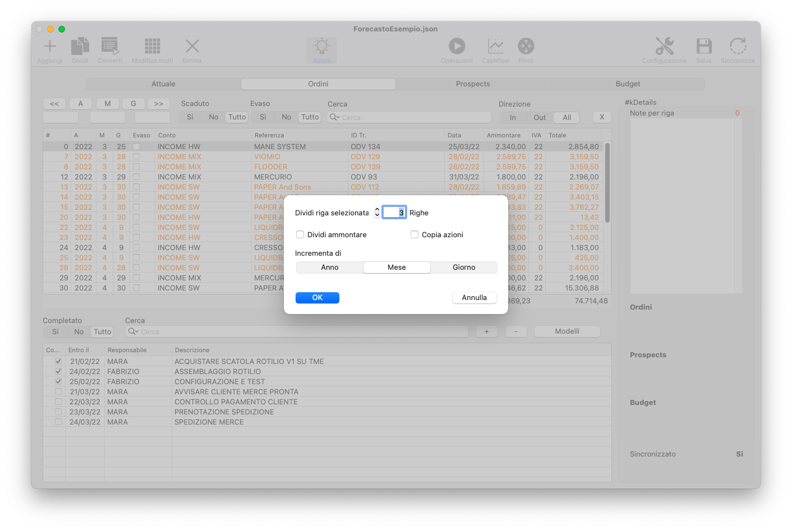

Impostando il campo "Dividi riga selezionata" a 12, selezionando la casella "Dividi ammontare" e selezionando "Incrementa di Mese" verranno costruite altre 11 righe con importo di € 800,00 e scadenze incrementali di un mese.

### Operazioni Acconto-Saldo

Nel caso di un offerta a cliente di cui sappiamo già, in caso di ordine, che avremo un acconto con pagamento all'ordine di € 2.000,00 e un saldo a consegna lavoro di € 8.000,00 per un totale di € 10.000,00 più IVA 22%, è consigliabile già nei Prospect inserire le due righe, con differenti date di ingresso nel cashflow e importi.
Le due righe avranno in comune, oltre al conto e la referenza, anche l'ID Transazione, che potrebbe essere il numero di offerta.
Le azioni da svolgere per "portare a casa il lavoro" verranno inserite su una delle due voci (forse meglio sulla prima delle due).

## Come modificare le operazioni

Le operazioni possono essere modificate singolarmente cliccando sulla cella desiderata e modificandone il valore.
Volendo modificare più righe in un colpo solo è necessario selezionarle (Click + Shift) e poi cliccare su `Modifica multi` per far comparire la finestra di dialogo come segue:

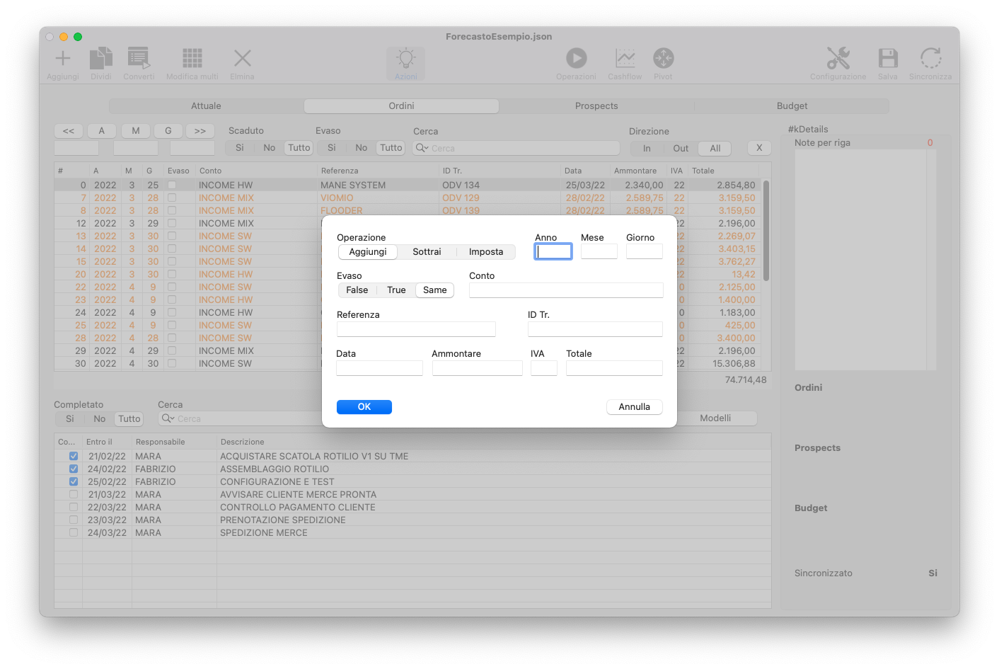

La modifica può essere operata sui campi mostrati nella finestra di dialogo. Verranno modificati solo i campi che verranno compilati.

Particolare attenzione va posta alla funzione "Operazione" che permette di spostare in blocco righe di operazioni da un mese all'altro o giorno o anno. Ad esempio, inserendo il valore 1 nella casella M e lasciando la selezione su "Aggiungi" tutte le righe selezionate verranno automaticamente spostate avanti di un mese per l'ingresso nel flusso di cassa.

## Le azioni

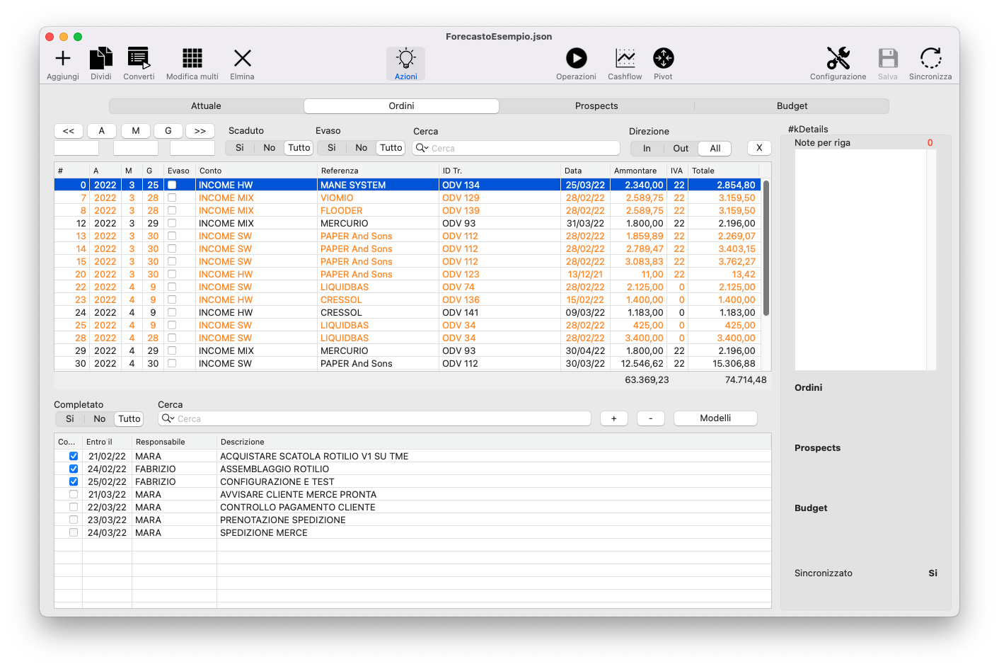

Ogni operazione può essere associata ad una o più azioni da svolgere perchè la stessa si concretizzi entro la data prefissata e possa passare ad esempio da Ordine ad Attuale. Ogni azione viene associata ad un "Responsabile" che se ne occupa, ad una data di scadenza e può essere smarcata come compiuta.

La combinazione di operazioni e azioni consente di mantenere il focus sulle cose realmente importanti e dare le giuste priorità alle attività aziendali.

Per attivare il pannello di elenco delle azioni associate ad un operazione si clicca sulla icona "Azioni".
Evidenziando la riga dell'operazione interessata verranno visualizzate le relative azioni.

E' possibile memorizzare delle sequenze di azioni in "modelli" riutilizzabili.

## Le viste analitiche

### Operazioni

La vista operazioni è quella che consente di capire "cosa dobbiamo fare oggi ?". Selezionando la check-box "Prossime azioni" verranno mostrate solo le prime in ordine temporale di ogni operazione, così da concentrare l'attenzione sulle prime cose fattibili. La vista è filtrabile anche in altri modi. Molto utile è il filtro per "Responsabile" che ci permette di vedere di che cosa si deve occupare ogni singolo responsabile.

### Flusso di cassa

Seguono alcuni esempi di analisi del flusso di cassa. Forecasto permette di analizzare il flusso di cassa considerando i diversi orizzonti temporali, dall'Attuale al Budget, simulando alla profondità desiderata considerando quindi la situazione in caso di acquisizione ordini, conversione o meno di clienti. Questa vista mette in evidenza di colore rosso le righe (giorni, mesi o anni) in cui il saldo va in negativo.

#### Mensile inclusi i prospect

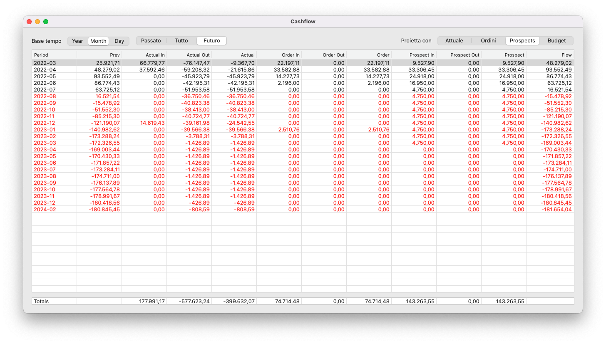

#### Giornaliero inclusi i prospect

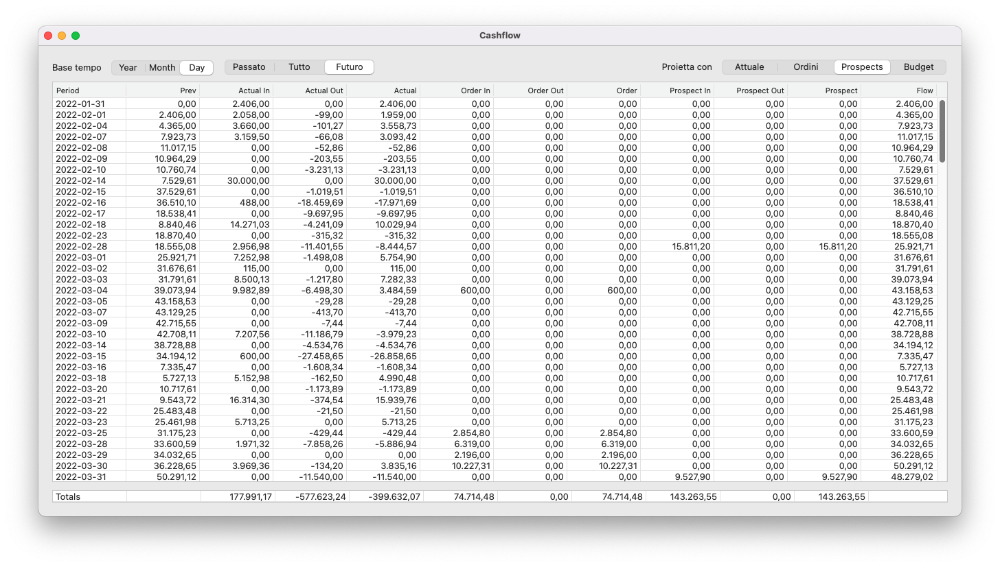

#### Mensile incluso il budget

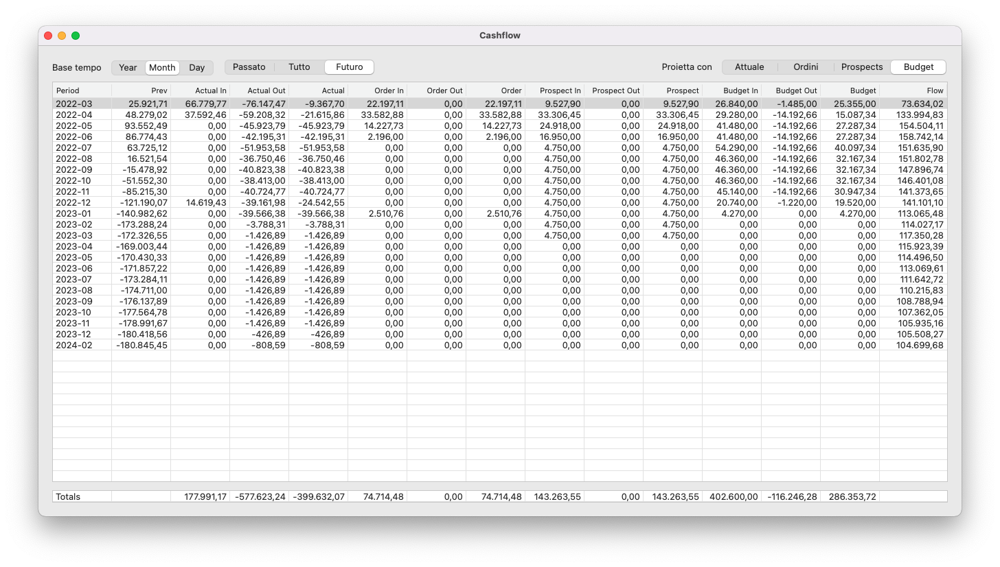

### Bilancio con conto economico

Un controllo sui costi e sui ricavi è sempre importante per individuare situazioni che alla lunga possono nuocere all'azienda. Inoltre, poter simulare il conto economico su base mese o anno considerando Attuale, Ordini, Prospect e Budget è di grande utilità per verificare che i target di costi e ricavi rispondano alle esigenze di bilancio a breve e lungo termine.

#### Annuale con budget

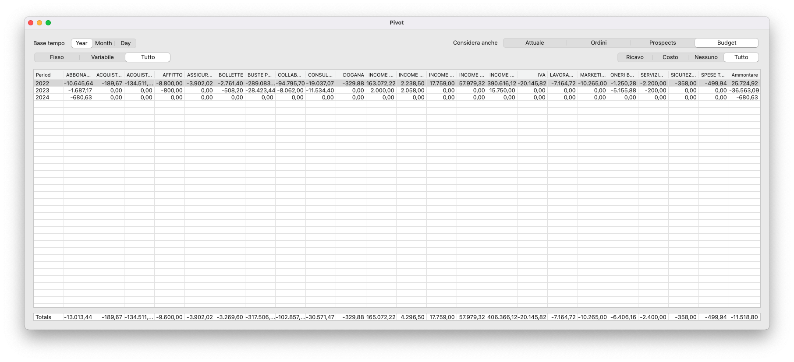

#### Mensile con budget

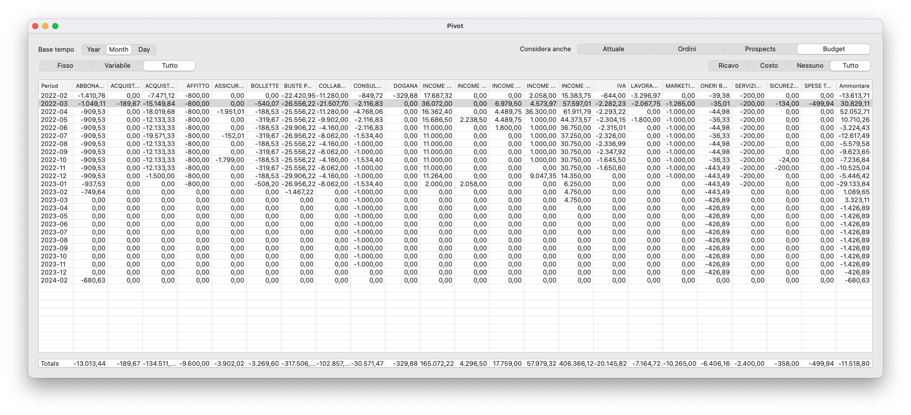

---
## Copyright
**Forecasto** è un software realizzato da Carlo Cassinari (c) 2022
